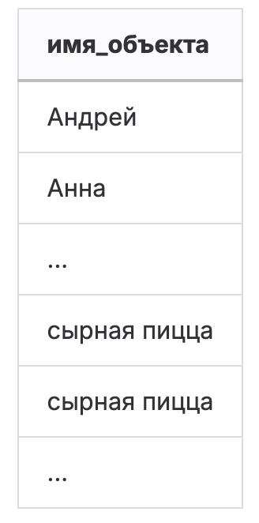
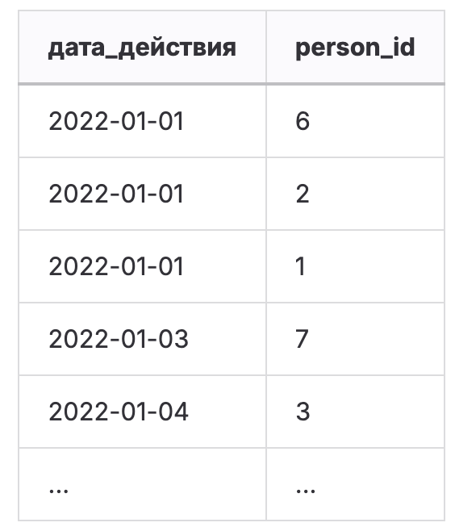
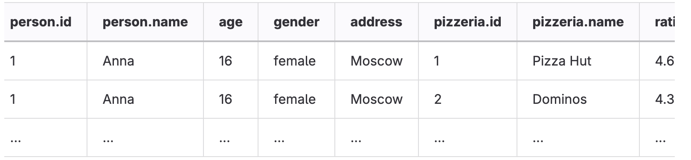
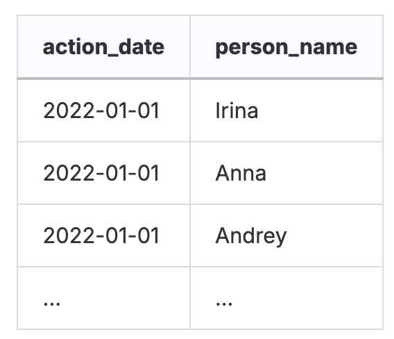
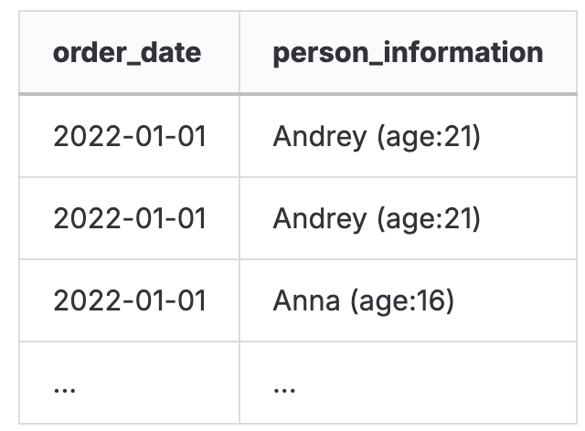
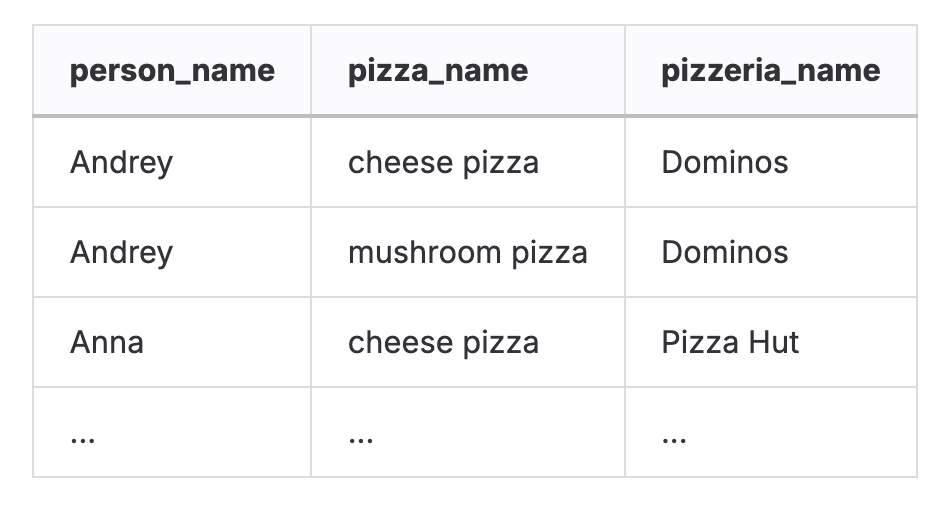

# DAY 01   
### Задание 00   
**Условие**   
Написать запрос SQL, который возвращает идентификатор меню и названия пиццы из `menu` таблицы, а также идентификатор и имя человека из `person` таблицы в одном глобальном списке (с именами столбцов, как показано в примере ниже), упорядоченном по столбцам object\_id, а затем по столбцам object\_name.   
Пример:   
| object\_id | object\_name |
|:-----------|:-------------|
|          1 |         Анна |
|          1 | cheese pizza |
|          … |            … |

### Задание 01   
   
**Условие**   
Изменить SQL-оператор из «Упражнения 00», удалив столбец object\_id. Затем измените порядок по object\_name для части данных из `person` таблицы, а затем из `menu` таблицы (как показано в примере ниже). Сохранить дубликаты!   
    
### Задание 02   
   
**Условие**
 Напишите SQL-запрос, который возвращает уникальные названия пицц из `menu` таблицы и сортирует их по столбцу pizza\_name в порядке убывания.
Нельзя использовать `DISTINCT`, `GROUP BY`, `HAVING`, любой тип `JOINs`   
   
### Задание 03   
**Условие**   
Напиcать SQL-запрос, который возвращает общие строки для атрибутов order\_date, person\_id из `person\_order` таблицы с одной стороны и visit\_date, person\_id из `person\_visits` таблицы с другой стороны (см. пример ниже). Другими словами, давайте найти идентификаторы людей, которые посетили и заказали пиццу в один и тот же день. Отсортировать action\_date в порядке возрастания, а person\_id в порядке убывания.   
    
   
### Задание 04   
**Условие**   
Нужно взять мультимножество `person\_id` из заказов за `2022-01-07` и «вычесть» из него мультимножество `person\_id` из визитов за `2022-01-07`   
### Задание 05   
**Условие**   
Вернуть все возможные комбинации строк из таблиц `person` и `pizzeria` (декартово произведение).   
Отсортировать результат по `person.id` , затем по `pizzeria.id`.   
Вывести колонки обеих таблиц (как в примере: данные человека + данные пиццерии).   
    
### Задание 06   
**Условие**   
Модифицировать стейтмент из 3го задания чтобы он:   
- Возвращал имя вместо айди   
- Отфильтровать action\_date по возрастанию, имена по убыванию   
   
Пример того что должно получиться   
    
   
### Задание 07   
   
**Условие**   
- вернуть дату заказа из order\_date, а также имя и возраст из таблицы person, отсортировать в ASC порядке   
- Вернуть в таком формате   
        
   
### Задание 08    
**Условие**   
Переписать код из прошлого задания используя NATURAL JOIN   
### Задание 09   
**Условие**
Вывести все непосещенные пиццерии с помощью IN а потом с помощью EXISTS   
   
### Задание 10   
**Условие**   
Написать запрос который вернет имена людей, название пиццы, пиццерию из которой был сделан заказ, отсротировать по возрастанию   
    
