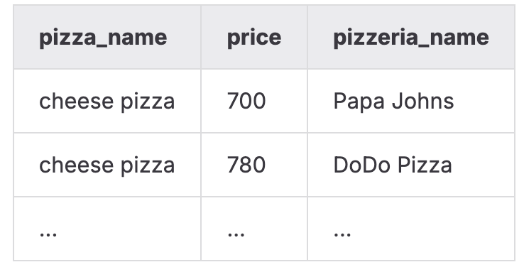
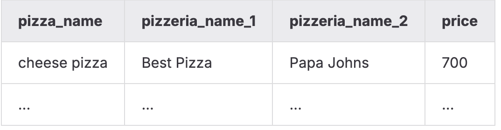

# DAY_03   
### Общая идея дня   
   
Этот день был посвящён работе с изменяемыми данными в базе: поиску, сравнению и обновлению информации, а также практическому применению операций INSERT, UPDATE и DELETE. Основной акцент — анализ поведения пользователей и меню через множественные выборки и операции над множествами, а также корректное добавление и удаление данных в реляционной модели.   
   
### Модель БД с которой происходила работа   
   
    
Таблица пиццерия   
|     Поле |         Тип |                                                         Описание |
|:---------|:------------|:-----------------------------------------------------------------|
|       id | PRIMARY KEY |                                Уникальный идентификатор пиццерии |
|     name |     VARCHAR |                                                Название пиццерии |
|   rating |     DECIMAL |                             Средний рейтинг пиццерии (от 0 до 5) |

Таблица person   
|     Поле |         Тип |                                                                 Описание |
|:---------|:------------|:-------------------------------------------------------------------------|
|       id | PRIMARY KEY |                                    Уникальный идентификатор пользователя |
|     name |     VARCHAR |                                                         Имя пользователя |
|      age |     INTEGER |                                                     Возраст пользователя |
|   gender |     VARCHAR |                                                         Пол пользователя |
|  address |     VARCHAR |                                                       Адрес пользователя |

Таблица menu   
|         Поле |         Тип |                                                                Описание |
|:-------------|:------------|:------------------------------------------------------------------------|
|           id | PRIMARY KEY |                                   Уникальный идентификатор позиции меню |
| pizzeria\_id | FOREIGN KEY |                                        Ссылка на пиццерию (pizzeria.id) |
|  pizza\_name |     VARCHAR |                                               Название пиццы в пиццерии |
|        price |     DECIMAL |                                                   Цена конкретной пиццы |

Таблица person\_visits   
|         Поле |         Тип |                                                           Описание |
|:-------------|:------------|:-------------------------------------------------------------------|
|           id | PRIMARY KEY |                                 Уникальный идентификатор посещения |
|   person\_id | FOREIGN KEY |                                 Ссылка на пользователя (person.id) |
| pizzeria\_id | FOREIGN KEY |                                   Ссылка на пиццерию (pizzeria.id) |
|  visit\_date |        DATE |                              Дата посещения (например, 2022-01-01) |

Таблица person\_order   
|        Поле |         Тип |                                                     Описание |
|:------------|:------------|:-------------------------------------------------------------|
|          id | PRIMARY KEY |                              Уникальный идентификатор заказа |
|  person\_id | FOREIGN KEY |                           Ссылка на пользователя (person.id) |
|    menu\_id | FOREIGN KEY |                             Ссылка на позицию меню (menu.id) |
| order\_date |        DATE |                           Дата заказа (например, 2022-01-01) |

   
**Было изучено:**   
- работа с DML-операциями (INSERT, UPDATE, DELETE) в реальных сценариях изменения данных;   
- использование операций над множествами: UNION, INTERSECT, EXCEPT (включая ALL-варианты);   
- анализ поведения пользователей через сравнение посещений и заказов;   
- определение неиспользуемых и «забытых» позиций меню и пиццерий;   
- корректное добавление новых записей без прямых идентификаторов (подзапросы, авторасчёт id);   
- массовые вставки данных через `INSERT … SELECT` и работу с `generate\_series`;   
- обработка динамических изменений в базе и поддержание целостности данных.   
   
   
   
### Задание 00   
**Условие**   
Сформировать выборку, содержащую:   
- название пиццы,   
- её стоимость,   
- название пиццерии,   
- дату посещения,   
   
для клиента Kate, но только для тех позиций меню, чья цена находится в диапазоне от 800 до 1000 рублей.   
Результат должен быть отсортирован по названию пиццы, цене и названию пиццерии.   
    
### Задание 01   
**Условие**   
Определить идентификаторы меню, по которым **не было ни одного заказа**.   
Использовать только базовый SQL без JOIN-операций.   
Результат — отсортированный список menu\_id.   
### Задание 02   
**Условие**   
На основе результата предыдущего задания вывести список «забытых» позиций меню:   
название пиццы, её цену и название пиццерии, которой она принадлежит.   
Отсортировать по названию пиццы и стоимости.   
    
### Задание 03   
**Условие**   
Вывести список пиццерий, которые чаще посещали женщины или чаще посещали мужчины.   
При использовании операторов над множествами ( `UNION ALL`, `INTERSECT ALL`, `EXCEPT ALL`) не устранять дубликаты.   
Результат отсортировать по названию пиццерии.   
### Задание 04   
**Условие**   
Определить объединённый список пиццерий, куда:   
- заказы поступали **только от женщин**,   
- или заказы поступали **только от мужчин**.   
   
Полученные два множества необходимо объединить (без дубликатов).   
Отсортировать итоговый список по названию пиццерии.   
### Задание 05   
**Условие**   
Вывести список всех пиццерий, которые посещал Андрей,   
но из которых он **не делал ни одного заказа**.   
Результат упорядочить по названию пиццерии.   
### Задание 06   
**Условие**   
Найти пары одинаковых пицц (одинаковое название и одинаковая цена),   
которые выпускаются разными пиццериями.   
Вывести:   
- название пиццы,   
- первую пиццерию,   
- вторую пиццерию,   
- цену.   
   
Результат отсортировать по `pizza\_name`.   
    
### Задание 07   
**Условие**   
Добавить в меню новую позицию:   
- название: **Greek pizza**   
- id: **19**,   
- цена: **800**,   
- принадлежит пиццерии Dominos (pizzeria\_id = 2).   
   
Внимание: операция изменяет данные. При необходимости базу можно восстановить из папки Materials.   
### Задание 08   
**Условие**   
Добавить новую пиццу:   
- название: **Sicilian pizza**,   
- id = максимальный существующий id + 1,   
- цена: **900**,   
- принадлежит Dominos — идентификатор пиццерии должен быть получен подзапросом.   
   
Запрещено использовать прямые числовые идентификаторы.   
### Задание 09   
**Условие**   
Добавить новые записи о посещениях Домино'с пользователями Денисом и Ириной 24 февраля 2022 года.   
Нельзя использовать прямые значения для первичных ключей и идентификаторов пиццерии.   
### Задание 10   
**Условие**   
Добавить новые заказы от Дениса и Ирины от 24 февраля 2022 года на новую пиццу **Sicilian pizza**.   
Нельзя использовать прямые значения идентификаторов.   
### Задание 11   
**Условие**   
Обновить цену «Greek pizza», уменьшив её на 10% от текущей стоимости.   
### Задание 12   
**Условие**   
Зарегистрировать заказы «Greek pizza» для **всех** клиентов на дату **25 февраля 2022 года**.   
Требования:   
- использовать конструкцию вида `INSERT INTO … SELECT …`,   
- использовать `generate\_series(...)` при необходимости,   
- не использовать прямые значения идентификаторов Primary Key или пиццерии,   
- запрещены оконные функции (например, `ROW\_NUMBER()`),   
- запрещены одиночные INSERT для каждой строки.   
   
### Задание 13   
**Условие**   
Выполнить два шага:   
1. Удалить все заказы, созданные в задании 12 (удаление по дате).   
2. Удалить позицию меню «Greek pizza».   
   
Операции изменяют данные — при необходимости базу можно восстановить из Materials.   
