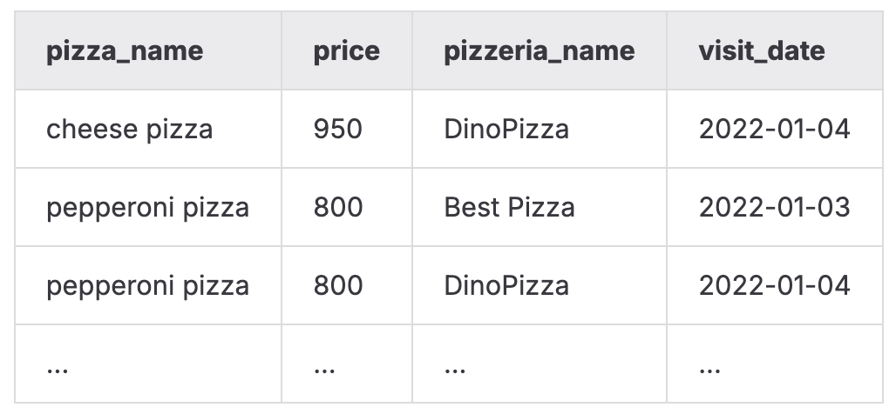
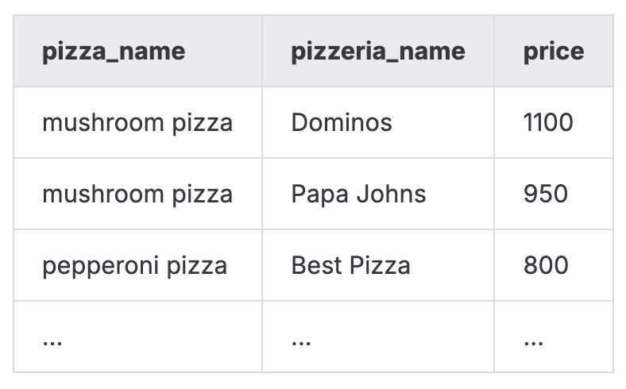

# SQLB3   
### Описание дня   
В этот день я работала с основами реляционной алгебры и практическим использованием различных типов JOIN в SQL. Основная цель — научиться комбинировать данные из нескольких таблиц, находить пропуски, анализировать связи и строить полнотые выборки даже при отсутствии соответствующих данных.   
### Было изучено:   
- различия между LEFT / RIGHT / FULL JOIN и их применение;   
- генерацию последовательностей данных через `generate\_series`;   
- поиск отсутствующих значений (data gaps);   
- объединение данных из разных источников в один результирующий набор;   
- использование CTE ( `WITH`) для структурирования запросов;   
- сортировку и форматирование данных в сложных выборках;   
   
   
Модель БД с которой происходила работа   
   
    
Таблица пиццерия   
|     Поле |         Тип |                                                         Описание |
|:---------|:------------|:-----------------------------------------------------------------|
|       id | PRIMARY KEY |                                Уникальный идентификатор пиццерии |
|     name |     VARCHAR |                                                Название пиццерии |
|   rating |     DECIMAL |                             Средний рейтинг пиццерии (от 0 до 5) |

Таблица person   
|     Поле |         Тип |                                                                 Описание |
|:---------|:------------|:-------------------------------------------------------------------------|
|       id | PRIMARY KEY |                                    Уникальный идентификатор пользователя |
|     name |     VARCHAR |                                                         Имя пользователя |
|      age |     INTEGER |                                                     Возраст пользователя |
|   gender |     VARCHAR |                                                         Пол пользователя |
|  address |     VARCHAR |                                                       Адрес пользователя |

Таблица menu   
|         Поле |         Тип |                                                                Описание |
|:-------------|:------------|:------------------------------------------------------------------------|
|           id | PRIMARY KEY |                                   Уникальный идентификатор позиции меню |
| pizzeria\_id | FOREIGN KEY |                                        Ссылка на пиццерию (pizzeria.id) |
|  pizza\_name |     VARCHAR |                                               Название пиццы в пиццерии |
|        price |     DECIMAL |                                                   Цена конкретной пиццы |

Таблица person\_visits   
|         Поле |         Тип |                                                           Описание |
|:-------------|:------------|:-------------------------------------------------------------------|
|           id | PRIMARY KEY |                                 Уникальный идентификатор посещения |
|   person\_id | FOREIGN KEY |                                 Ссылка на пользователя (person.id) |
| pizzeria\_id | FOREIGN KEY |                                   Ссылка на пиццерию (pizzeria.id) |
|  visit\_date |        DATE |                              Дата посещения (например, 2022-01-01) |

Таблица person\_order   
|        Поле |         Тип |                                                     Описание |
|:------------|:------------|:-------------------------------------------------------------|
|          id | PRIMARY KEY |                              Уникальный идентификатор заказа |
|  person\_id | FOREIGN KEY |                           Ссылка на пользователя (person.id) |
|    menu\_id | FOREIGN KEY |                             Ссылка на позицию меню (menu.id) |
| order\_date |        DATE |                           Дата заказа (например, 2022-01-01) |

###    
### Задание 00   
**Условие**   
Составить SQL-запрос, который выводит список всех пиццерий вместе с их рейтингами, но только тех, у которых **нет ни одного посещения** в таблице `person\_visits`.   
Необходимо использовать только базовые возможности ANSI SQL.   
Запрещено применять конструкции: `IN`, `NOT IN`, `EXISTS`, `NOT EXISTS`, `UNION`, `EXCEPT`, `INTERSECT`.   
   
### Задание 01   
**Условие**   
Написать SQL-запрос, который возвращает все даты с 1 по 10 января 2022 года, которые **не встречаются** в посещениях двух пользователей — с идентификаторами 1 и 2.   
То есть требуется вывести даты, которые оба этих человека пропустили.   
Для генерации диапазона дат нужно использовать `generate\_series(...)`.   
Запрещены: `IN`, `NOT IN`, `EXISTS`, `NOT EXISTS`, `UNION`, `EXCEPT`, `INTERSECT`.   
Результат отсортировать по дате.   
    
### Задание 02   
**Условие**   
Сформировать объединённый список:   
- всех людей, которые посещали или не посещали пиццерии с 1 по 3 января 2022 года,   
- всех пиццерий, которые посещались или не посещались в этот период,   
- всех фактических посещений за эти даты.   
   
Требуется вывести три столбца:   
- `person\_name` — либо имя человека, либо `'-'`, если отсутствует,   
- `visit\_date` — дата посещения или `NULL`,   
- `pizzeria\_name` — название пиццерии или `'-'`.   
   
Необходимо отразить **всё множество данных** — даже при отсутствии соответствий.   
Результат отсортировать по всем трём полям.   
    
### Задание 03   
**Условие**   
Выполнить задачу из Задания 01 (поиск пропущенных дат),   
но переписать запрос так, чтобы генерация дат была вынесена в CTE ( `WITH`).   
Вывод должен полностью совпадать с результатом задания 01.   
   
### Задание 04   
**Условие**   
Вывести информацию о пиццах с начинкой «mushroom» или «pepperoni», включая:   
- название пиццы ( `pizza\_name`),   
- название пиццерии ( `pizzeria\_name`),   
- цену ( `price`).   
   
Результат отсортировать по названию пиццы, затем по названию пиццерии.   
    
### Задание 05   
**Условие**   
Получить список имён всех женщин старше 25 лет.   
Результат отсортировать по имени.   
   
### Задание 06   
**Условие**   
Вывести все пиццы, которые заказывали Анна или Денис,   
а также пиццерии, в которых эти пиццы были заказаны.   
Требуется вывести два поля:   
- `pizza\_name`,   
- `pizzeria\_name`.   
   
Отсортировать по обоим столбцам.   
    
### Задание 07   
**Условие**   
Определить, в какой пиццерии Дмитрий был 8 января 2022 года,   
и где в этот день он мог купить пиццу по цене ниже 800 рублей.   
Требуется вывести название подходящей пиццерии.   
   
### Задание 08   
**Условие**   
Вывести имена всех мужчин, проживающих в Москве или Самаре,   
которые заказывали пиццу:   
- с пепперони,   
- или с грибами,   
- или оба варианта.   
   
Результат нужно отсортировать в обратном алфавитном порядке.   
   
### Задание 09   
**Условие**   
Определить женщин, которые заказывали **и** сырную, **и** пепперони пиццу (оба вида присутствуют в их заказах).   
Сортировка в алфавитном порядке.   
   
### Задание 10   
**Условие**   
Найти всех людей, которые живут по одному адресу.   
Нужно вывести:   
- `person\_name1`   
- `person\_name2`   
- `common\_address`   
   
Результат отсортировать по имени первого человека, имени второго человека и адресу.   
Использовать указанные названия столбцов.   
