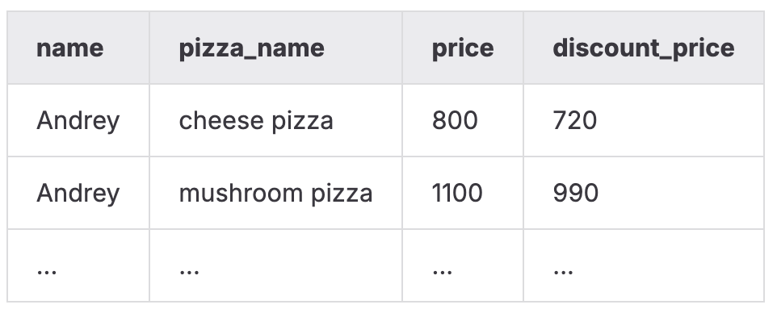

# SQLB5   
### Описание дня:   
   
Этот день был посвящён изучению представлений в базе данных — как виртуальных, так и материализованных — и их использованию для анализа и трансформации данных. Я работала с генерацией временных диапазонов, поиском пропусков, операциями над множествами и управлением объектами базы. День фокусировался на создании логических слоёв данных и работе с их обновлением.   
### **Я научилась:**   
- создавать и использовать представления (views) для фильтрации и объединения данных;   
- работать с материализованными представлениями, включая их обновление;   
- генерировать диапазоны дат через `generate\_series`;   
- находить пропущенные значения с помощью виртуальных таблиц;   
- применять операции над множествами в SQL;   
- создавать вычисляемые поля и представления со скидками;   
- управлять объектами базы данных: создавать, обновлять и удалять их.   
   
   
### Модель БД с которой происходила работа   
   
    
Таблица пиццерия   
|     Поле |         Тип |                                                         Описание |
|:---------|:------------|:-----------------------------------------------------------------|
|       id | PRIMARY KEY |                                Уникальный идентификатор пиццерии |
|     name |     VARCHAR |                                                Название пиццерии |
|   rating |     DECIMAL |                             Средний рейтинг пиццерии (от 0 до 5) |

Таблица person   
|     Поле |         Тип |                                                                 Описание |
|:---------|:------------|:-------------------------------------------------------------------------|
|       id | PRIMARY KEY |                                    Уникальный идентификатор пользователя |
|     name |     VARCHAR |                                                         Имя пользователя |
|      age |     INTEGER |                                                     Возраст пользователя |
|   gender |     VARCHAR |                                                         Пол пользователя |
|  address |     VARCHAR |                                                       Адрес пользователя |

Таблица menu   
|         Поле |         Тип |                                                                Описание |
|:-------------|:------------|:------------------------------------------------------------------------|
|           id | PRIMARY KEY |                                   Уникальный идентификатор позиции меню |
| pizzeria\_id | FOREIGN KEY |                                        Ссылка на пиццерию (pizzeria.id) |
|  pizza\_name |     VARCHAR |                                               Название пиццы в пиццерии |
|        price |     DECIMAL |                                                   Цена конкретной пиццы |

Таблица person\_visits   
|         Поле |         Тип |                                                           Описание |
|:-------------|:------------|:-------------------------------------------------------------------|
|           id | PRIMARY KEY |                                 Уникальный идентификатор посещения |
|   person\_id | FOREIGN KEY |                                 Ссылка на пользователя (person.id) |
| pizzeria\_id | FOREIGN KEY |                                   Ссылка на пиццерию (pizzeria.id) |
|  visit\_date |        DATE |                              Дата посещения (например, 2022-01-01) |

Таблица person\_order   
|        Поле |         Тип |                                                     Описание |
|:------------|:------------|:-------------------------------------------------------------|
|          id | PRIMARY KEY |                              Уникальный идентификатор заказа |
|  person\_id | FOREIGN KEY |                           Ссылка на пользователя (person.id) |
|    menu\_id | FOREIGN KEY |                             Ссылка на позицию меню (menu.id) |
| order\_date |        DATE |                           Дата заказа (например, 2022-01-01) |

### Задание 00   
**Условие**   
Создать два отдельных представления, каждое с теми же полями, что и таблица `person`,   
но с фильтрацией по полу:   
- `v\_persons\_female` — содержит только женщин,   
- `v\_persons\_male` — содержит только мужчин.   
   
   
### Задание 01   
**Условие**   
Используя созданные в предыдущем задании представления, вывести общий список имён всех мужчин и женщин.   
Необходимо объединить данные двух представлений и отсортировать вывод по имени.   
### Задание 02   
**Условие**   
Создать представление `v\_generated\_dates`, которое содержит последовательность дат   
с 1 по 31 января 2022 года (тип DATE), сформированную через `generate\_series(...)`.   
Вывести один столбец — `generated\_date`,   
и отсортировать данные по возрастанию даты.   
Разрешено: `generate\_series(...)`.   
### Задание 03   
**Условие**   
Используя представление `v\_generated\_dates`, получить список всех дат января 2022 года,   
в которые **не было ни одного посещения**.   
Требуется вывести одну колонку `missing\_date` и отсортировать результат по дате.   
### Задание 04   
**Условие**   
Реализовать симметрическую разность двух множеств на базе таблицы `person\_visits`.   
Нужно вычислить выражение:   
**(R − S) ∪ (S − R)**   
где:   
- R — посещения за 2 января 2022 года,   
- S — посещения за 6 января 2022 года,   
- сравнение осуществляется по полю `person\_id`.   
   
Результат — один столбец `person\_id`, отсортированный по возрастанию.   
Итоговый запрос сохранить в виде представления `v\_symmetric\_union`.   
### Задание 05   
**Условие**   
Создать представление `v\_price\_with\_discount`, содержащее:   
- имя клиента ( `person\_name`),   
- название пиццы ( `pizza\_name`),   
- реальную цену ( `real\_price`),   
- цену со скидкой 10% ( `discount\_price` — привести к `integer`).   
   
Результат должен быть отсортирован по имени клиента и названию пиццы.   
    
### Задание 06   
**Условие**   
Создать **материализованное** представление `mv\_dmitriy\_visits\_and\_eats`,   
основанное на запросе, который находит пиццерию,   
которую Дмитрий посещал 8 января 2022 года,   
и где продаётся пицца дешевле 800 рублей.   
Нужно сохранить данные (использовать `WITH DATA`).   
### Задание 07   
**Условие**   
Добавить новый визит Дмитрия (который также удовлетворяет условиям из задания 06),   
но посещение должно быть в **другой** пиццерии, не совпадающей с предыдущим результатом.   
После этого обновить материализованное представление `mv\_dmitriy\_visits\_and\_eats`.   
Запрещено использовать прямые числовые значения для:   
- Primary Key,   
- person\_id,   
- pizzeria\_id.   
   
### Задание 08   
**Условие**   
Удалить все созданные в рамках этого дня виртуальные представления и существующее материализованное представление.   
То есть очистить базу от всех объектов, созданных в заданиях 00–07.   
