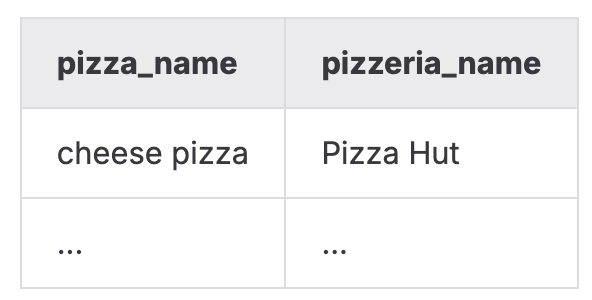

# DAY_05   
   
   
Этот день был посвящён изучению механизмов индексирования в PostgreSQL и тому, как индексы влияют на скорость выполнения запросов. Я работала с разными типами индексов, анализировала планы выполнения через `EXPLAIN ANALYZE` и улучшала производительность запросов путём подбора оптимальной структуры данных.   
### **Отработанные навыки:**   
- создание BTree-индексов для внешних ключей;   
- анализ использования индексов через `EXPLAIN ANALYZE`;   
- построение функциональных индексов;   
- создание многоколоночных индексов;   
- реализация уникальных и частичных уникальных индексов;   
- подбор покрывающего индекса для оптимизации сложного запроса;   
- оценка влияния индекса на Execution Time.   
   
   
### Модель БД с которой происходила работа   
   
    
Таблица пиццерия   
|     Поле |         Тип |                                                         Описание |
|:---------|:------------|:-----------------------------------------------------------------|
|       id | PRIMARY KEY |                                Уникальный идентификатор пиццерии |
|     name |     VARCHAR |                                                Название пиццерии |
|   rating |     DECIMAL |                             Средний рейтинг пиццерии (от 0 до 5) |

Таблица person   
|     Поле |         Тип |                                                                 Описание |
|:---------|:------------|:-------------------------------------------------------------------------|
|       id | PRIMARY KEY |                                    Уникальный идентификатор пользователя |
|     name |     VARCHAR |                                                         Имя пользователя |
|      age |     INTEGER |                                                     Возраст пользователя |
|   gender |     VARCHAR |                                                         Пол пользователя |
|  address |     VARCHAR |                                                       Адрес пользователя |

Таблица menu   
|         Поле |         Тип |                                                                Описание |
|:-------------|:------------|:------------------------------------------------------------------------|
|           id | PRIMARY KEY |                                   Уникальный идентификатор позиции меню |
| pizzeria\_id | FOREIGN KEY |                                        Ссылка на пиццерию (pizzeria.id) |
|  pizza\_name |     VARCHAR |                                               Название пиццы в пиццерии |
|        price |     DECIMAL |                                                   Цена конкретной пиццы |

Таблица person\_visits   
|         Поле |         Тип |                                                           Описание |
|:-------------|:------------|:-------------------------------------------------------------------|
|           id | PRIMARY KEY |                                 Уникальный идентификатор посещения |
|   person\_id | FOREIGN KEY |                                 Ссылка на пользователя (person.id) |
| pizzeria\_id | FOREIGN KEY |                                   Ссылка на пиццерию (pizzeria.id) |
|  visit\_date |        DATE |                              Дата посещения (например, 2022-01-01) |

Таблица person\_order   
|        Поле |         Тип |                                                     Описание |
|:------------|:------------|:-------------------------------------------------------------|
|          id | PRIMARY KEY |                              Уникальный идентификатор заказа |
|  person\_id | FOREIGN KEY |                           Ссылка на пользователя (person.id) |
|    menu\_id | FOREIGN KEY |                             Ссылка на позицию меню (menu.id) |
| order\_date |        DATE |                           Дата заказа (например, 2022-01-01) |

###    
### Задание 00   
**Условие**   
Создать для каждого внешнего ключа в базе данных отдельный BTree-индекс.   
Имя каждого индекса должно соответствовать шаблону:

```
idx_{имя_таблицы}_{имя_столбца}
```

Например, для столбца `pizzeria\_id` в таблице `menu` индекс должен называться   
`idx\_menu\_pizzeria\_id`.   
   
### Задание 01   
**Условие**   
Написать SQL-запрос, который выводит пары:   
- название пиццы,   
- название пиццерии.   
   
Порядок строк не важен.   
После этого необходимо подтвердить, что индексы действительно используются:   
предоставить вывод `EXPLAIN ANALYZE`, в котором присутствует использование созданных индексов   
(например, `Index Scan` или `Index Only Scan`).   
   
Подсказка — в задании упомянуто, что иногда последовательное сканирование нужно отключать вручную.   
   
Пример того что должно получиться   
    
   
### Задание 02   
**Условие**   
Создать функциональный индекс BTree на таблице `person` с именем `idx\_person\_name`,   
который хранит имена ( `name`) в верхнем регистре ( `UPPER(name)`).   
Затем написать любой SQL-запрос, для которого этот индекс будет задействован,   
и подтвердить его использование планом выполнения `EXPLAIN ANALYZE`.   
   
### Задание 03   
**Условие**   
Создать многоколоночный BTree-индекс `idx\_person\_order\_multi`,   
оптимизированный для следующего запроса:

```
SELECT person_id, menu_id, order_date
FROM person_order
WHERE person_id = 8 AND menu_id = 19;
```

После создания индекса необходимо выполнить запрос с выводом `EXPLAIN ANALYZE`   
и показать, что в плане используется Index Only Scan по созданному индексу.   
   
### Задание 04   
**Условие**   
Создать уникальный B-tree индекс для столбцов pizzeria\_id и pizza\_name из таблицы menu.    
После создания индекса необходимо выполнить запрос с выводом `EXPLAIN ANALYZE`   
и показать, что в плане используется Index Only Scan по созданному индексу.   
   
### Задание 05   
**Условие**   
Создать частично уникальный BTree-индекс `idx\_person\_order\_order\_date`   
на таблице `person\_order`, который обеспечивает уникальность пары   
( `person\_id`, `menu\_id`) только для записей с датой `**2022-01-01**`.   
То есть ограничение применяется не на всю таблицу, а только для строк,   
где `order\_date = '2022-01-01'`.   
План `EXPLAIN ANALYZE` должен содержать строку вида:

```
Index Only Scan using idx_person_order_order_date on person_order …
```
   
### Задание 06   
**Условие**   
Проанализировать приведённый в ридми SQL-запрос,   
который использует оконную функцию и соединение таблиц:

```
SELECT
    m.pizza_name AS pizza_name,
    max(rating) OVER (PARTITION BY rating ORDER BY rating ROWS BETWEEN UNBOUNDED PRECEDING AND UNBOUNDED FOLLOWING) AS k
FROM menu m
JOIN pizzeria pz ON m.pizzeria_id = pz.id
ORDER BY 1, 2;
```

Нужно создать BTree-индекс с именем `idx\_1`,   
который заметно улучшит Execution Time данного запроса.   
После каждого эксперимента индекс `idx\_1` должен удаляться (мануально),   
поскольку задание имитирует подбор лучшего покрывающего индекса.   
В решении необходимо предоставить два плана `EXPLAIN ANALYZE`:   
- до создания индекса (медленнее),   
- после создания правильного индекса (быстрее).   
   
   
