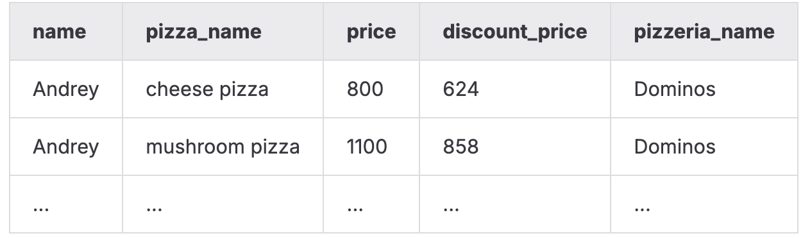

# SQLB8   
Этот день был посвящён расширению логики работы базы данных: созданию бизнес-сущностей, расчёту персональных скидок, настройке ограничений и обеспечению качества данных. Основной акцент был на добавлении новых таблиц, автоматизации генерации идентификаторов, управлении целостностью и использовании индексов для предотвращения дубликатов.   
**Изученные навыки:**   
- проектирование новых таблиц с первичными и внешними ключами;   
- массовое заполнение данных через `INSERT ... SELECT` и оконные функции;   
- расчёт бизнес-правил внутри SQL-запросов;   
- создание уникальных индексов и управление структурой данных;   
- добавление CHECK-ограничений, значений по умолчанию и правил валидации;   
- документирование таблиц и столбцов через комментарии;   
- автоматизация выдачи Primary Key через последовательности.   
   
   
Модель БД с которой происходила работа   
   
    
Таблица пиццерия   
|     Поле |         Тип |                                                         Описание |
|:---------|:------------|:-----------------------------------------------------------------|
|       id | PRIMARY KEY |                                Уникальный идентификатор пиццерии |
|     name |     VARCHAR |                                                Название пиццерии |
|   rating |     DECIMAL |                             Средний рейтинг пиццерии (от 0 до 5) |

Таблица person   
|     Поле |         Тип |                                                                 Описание |
|:---------|:------------|:-------------------------------------------------------------------------|
|       id | PRIMARY KEY |                                    Уникальный идентификатор пользователя |
|     name |     VARCHAR |                                                         Имя пользователя |
|      age |     INTEGER |                                                     Возраст пользователя |
|   gender |     VARCHAR |                                                         Пол пользователя |
|  address |     VARCHAR |                                                       Адрес пользователя |

Таблица menu   
|         Поле |         Тип |                                                                Описание |
|:-------------|:------------|:------------------------------------------------------------------------|
|           id | PRIMARY KEY |                                   Уникальный идентификатор позиции меню |
| pizzeria\_id | FOREIGN KEY |                                        Ссылка на пиццерию (pizzeria.id) |
|  pizza\_name |     VARCHAR |                                               Название пиццы в пиццерии |
|        price |     DECIMAL |                                                   Цена конкретной пиццы |

Таблица person\_visits   
|         Поле |         Тип |                                                           Описание |
|:-------------|:------------|:-------------------------------------------------------------------|
|           id | PRIMARY KEY |                                 Уникальный идентификатор посещения |
|   person\_id | FOREIGN KEY |                                 Ссылка на пользователя (person.id) |
| pizzeria\_id | FOREIGN KEY |                                   Ссылка на пиццерию (pizzeria.id) |
|  visit\_date |        DATE |                              Дата посещения (например, 2022-01-01) |

Таблица person\_order   
|        Поле |         Тип |                                                     Описание |
|:------------|:------------|:-------------------------------------------------------------|
|          id | PRIMARY KEY |                              Уникальный идентификатор заказа |
|  person\_id | FOREIGN KEY |                           Ссылка на пользователя (person.id) |
|    menu\_id | FOREIGN KEY |                             Ссылка на позицию меню (menu.id) |
| order\_date |        DATE |                           Дата заказа (например, 2022-01-01) |

### Задание 00   
**Условие**   
Создать новую таблицу `person\_discounts`, которая будет хранить персональные скидки клиентов по пиццериям.   
Требования к структуре:   
- завести поле `id` и сделать его Primary Key (тип — такой же, как во всех других таблицах проекта);   
- добавить поля `person\_id` и `pizzeria\_id`, которые должны быть Foreign Key на таблицы `person` и `pizzeria`;   
- имена ограничений для внешних ключей должны соответствовать шаблону `fk\_{table}\_{column}`,   
    например: `fk\_person\_discounts\_person\_id`;   
- добавить поле `discount` для процента скидки, тип — numeric.   
   
Разрешено: SQL, DML, DDL.   
   
### Задание 01   
**Условие**   
Заполнить таблицу `person\_discounts` данными на основе таблицы `person\_order`.   
Требуется:   
- сгруппировать заказы по `person\_id` и `pizzeria\_id`;   
- рассчитать процент скидки по правилам:   
    - если заказов = 1 → 10.5   
    - если заказов = 2 → 22   
    - иначе → 30   
- вставлять данные через конструкцию   
    `INSERT INTO ... SELECT ...`;   
- поле `id` генерировать через оконную функцию:   
    `ROW\_NUMBER() OVER () AS id`.   
   
Разрешено: SQL, DML, DDL.   
   
### Задание 02   
**Условие**   
Вернуть историю заказов с фактической ценой и ценой с учётом скидки.   
Вывести:   
- имя клиента,   
- название пиццы,   
- исходную стоимость,   
- цену со скидкой,   
- название пиццерии.   
   
Отсортировать по имени пользователя и названию пиццы.   
    
   
### Задание 03   
**Условие**   
Создать уникальный многоколоночный индекс `idx\_person\_discounts\_unique`,   
который запрещает дублирование пары:   
- `person\_id`,   
- `pizzeria\_id`.   
   
После создания индекса нужно выполнить любой SQL-запрос и продемонстрировать использование индекса через вывод `EXPLAIN ANALYZE`.   
   
### Задание 04   
**Условие**   
Добавить ограничения целостности для таблицы `person\_discounts`:   
1. `person\_id` НЕ может быть NULL — имя ограничения `ch\_nn\_person\_id`;   
2. `pizzeria\_id` НЕ может быть NULL — имя ограничения `ch\_nn\_pizzeria\_id`;   
3. `discount` НЕ может быть NULL — имя `ch\_nn\_discount`;   
4. для поля `discount` установить значение по умолчанию **0**;   
5. задать проверку, что скидка находится в диапазоне 0–100   
    — имя ограничения `ch\_range\_discount`.   
   
Разрешено: SQL, DML, DDL.   
   
### Задание 05   
**Условие**   
Добавить документирующие комментарии к таблице `person\_discounts`   
и ко всем её столбцам — на русском или английском языке.   
Комментарии должны описывать бизнес-назначение таблицы и каждого атрибута   
(например: «хранит индивидуальные скидки клиента» и т.д.).   
   
### Задание 06   
**Условие**   
Настроить автоматическую генерацию Primary Key для таблицы `person\_discounts`.   
Требуется:   
- создать последовательность `seq\_person\_discounts`, начинающуюся с 1;   
- установить для поля `id` значение по умолчанию:   
    `DEFAULT nextval('seq\_person\_discounts')`;   
- вычислить следующее значение последовательности как:   
    **количество строк в таблице + 1**   
    (жёстко прописывать число — **запрещено**).   
   
Запрещено: хардкод значений, которые зависят от числа строк.   
Разрешено: SQL, DML, DDL.   
   
   
