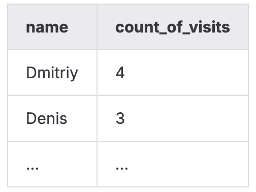
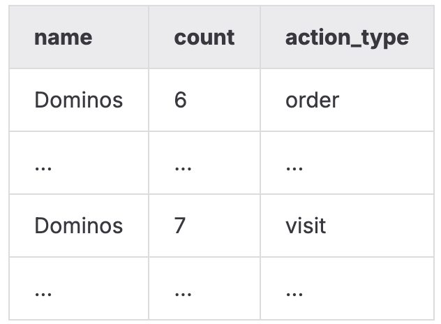
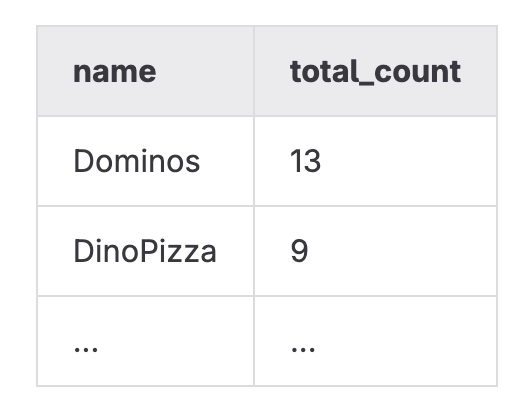
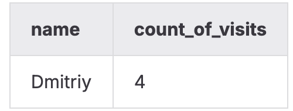
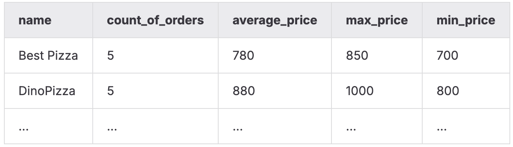
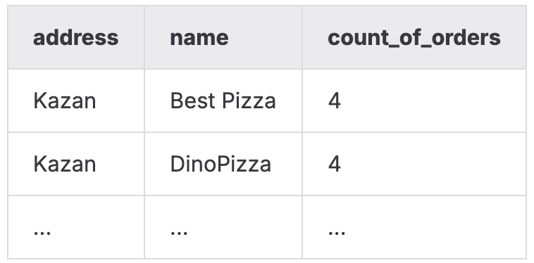
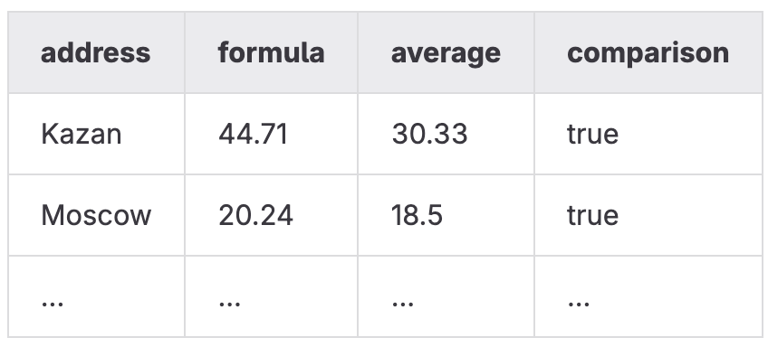

# DAY_07   
Этот день был посвящён работе с агрегированными данными и аналитическими запросами в SQL. Я училась превращать сырые данные в понятные бизнес-метрики, выполнять группировки, расчёты, сравнения и объединять результаты из разных источников для получения осмысленной статистики.   
**Изученные навыки:**   
- базовые и расширенные агрегирующие функции (COUNT, AVG, MAX, MIN);   
- группировка данных с `GROUP BY` и фильтрация агрегатов;   
- сортировка результирующих наборов по нескольким критериям;   
- формирование ранкингов и ограничение количества строк;   
- объединение аналитических результатов из разных таблиц;   
- создание вычисляемых столбцов и сравнительных метрик;   
- анализ поведения клиентов и популярности заведений;   
- работа с агрегированием на уровне адресов, людей и пиццерий.   
   
   
## Модель БД с которой происходила работа   
   
    
Таблица пиццерия   
|     Поле |         Тип |                                                         Описание |
|:---------|:------------|:-----------------------------------------------------------------|
|       id | PRIMARY KEY |                                Уникальный идентификатор пиццерии |
|     name |     VARCHAR |                                                Название пиццерии |
|   rating |     DECIMAL |                             Средний рейтинг пиццерии (от 0 до 5) |

Таблица person   
|     Поле |         Тип |                                                                 Описание |
|:---------|:------------|:-------------------------------------------------------------------------|
|       id | PRIMARY KEY |                                    Уникальный идентификатор пользователя |
|     name |     VARCHAR |                                                         Имя пользователя |
|      age |     INTEGER |                                                     Возраст пользователя |
|   gender |     VARCHAR |                                                         Пол пользователя |
|  address |     VARCHAR |                                                       Адрес пользователя |

Таблица menu   
|         Поле |         Тип |                                                                Описание |
|:-------------|:------------|:------------------------------------------------------------------------|
|           id | PRIMARY KEY |                                   Уникальный идентификатор позиции меню |
| pizzeria\_id | FOREIGN KEY |                                        Ссылка на пиццерию (pizzeria.id) |
|  pizza\_name |     VARCHAR |                                               Название пиццы в пиццерии |
|        price |     DECIMAL |                                                   Цена конкретной пиццы |

Таблица person\_visits   
|         Поле |         Тип |                                                           Описание |
|:-------------|:------------|:-------------------------------------------------------------------|
|           id | PRIMARY KEY |                                 Уникальный идентификатор посещения |
|   person\_id | FOREIGN KEY |                                 Ссылка на пользователя (person.id) |
| pizzeria\_id | FOREIGN KEY |                                   Ссылка на пиццерию (pizzeria.id) |
|  visit\_date |        DATE |                              Дата посещения (например, 2022-01-01) |

Таблица person\_order   
|        Поле |         Тип |                                                     Описание |
|:------------|:------------|:-------------------------------------------------------------|
|          id | PRIMARY KEY |                              Уникальный идентификатор заказа |
|  person\_id | FOREIGN KEY |                           Ссылка на пользователя (person.id) |
|    menu\_id | FOREIGN KEY |                             Ссылка на позицию меню (menu.id) |
| order\_date |        DATE |                           Дата заказа (например, 2022-01-01) |

### Задание 00   
**Условие**   
Выполнить базовую агрегацию данных: вывести идентификатор человека ( `person\_id`) и количество посещений им любых пиццерий.   
Результат нужно отсортировать:   
1. сначала по количеству посещений — по убыванию,   
2. затем по `person\_id` — по возрастанию.   
   
   
Пример того что должно получиться   
    
### Задание 01   
**Условие**   
Модифицировать запрос из задания 00 так, чтобы вместо идентификатора выводилось имя человека.   
Дополнительно требуется получить только топ-4 наиболее активных пользователя в каждой пиццерии, отсортированных по имени.   
   
Пример того что должно получиться   
    
   
### Задание 02   
**Условие**   
Вывести топ-3 пиццерии, которые занимают первые места:   
- по числу заказов,   
- по числу посещений.   
   
Объединить результаты в один общий набор, добавив столбец `action\_type`, который принимает значения:   
- `'order'` — данные из таблицы заказов,   
- `'visit'` — данные из таблицы посещений.   
   
Отсортировать итог по `action\_type` (по возрастанию), затем по количеству (столбец `count` по убыванию).   
   
Пример того что должно получиться   
    
   
### Задание 03   
**Условие**   
Построить расширенную статистику по пиццериям, объединив:   
- общее количество посещений,   
- общее количество заказов.   
   
Нужно сгруппировать данные по имени пиццерии и вычислить итоговую сумму ( `total\_count`) — сумма заказов и посещений (учитывая, что некоторые пиццерии могут отсутствовать в одной из таблиц).   
Отсортировать результат:   
1. по `total\_count` — по убыванию,   
2. по названию пиццерии — по возрастанию.   
   
Можно использовать в качестве основы запрос из второго задания.   
Пример того что должно получиться   
    
### Задание 04   
**Условие**   
Вывести имя человека и количество его посещений, если это количество превышает 3.   
Важно:   
запрещено использовать `WHERE`.   
Разрешается применять только конструкции для группировок.   
   
Пример того что должно получиться   
    
   
### Задание 05   
**Условие**   
Получить список уникальных имён людей, которые делали хотя бы один заказ.   
С сортировкой по имени.   
Важно:   
- запрещены любые операции над множествами ( `UNION`, `INTERSECT`, `EXCEPT`, и их вариации)   
- запрещён `GROUP BY`   
   
   
### Задание 06   
**Условие**   
Для каждой пиццерии вернуть:   
- общее количество заказов,   
- среднюю цену всех заказанных пицц (округлить до 2 знаков),   
- максимальную цену,   
- минимальную цену.   
   
Вывести название пиццерии и перечисленные показатели.   
Отсортировать по названию пиццерии.   
Пример того что должно получиться   
    
### Задание 07   
**Условие**   
Вычислить глобальный средний рейтинг всех пиццерий.   
Имя поля — `global\_rating`.   
Результат округлить до 4 знаков после запятой.   
   
### Задание 08   
**Условие**   
Построить выборку, которая показывает:   
- адрес человека(назвать колонку person\_adress),   
- название пиццерии в его городе(назвать колонку name),   
- количество заказов этого человека в данной пиццерии(назвать колонку count\_of\_orders).   
   
Предположение: человек посещает и заказывает только в пиццериях своего города.   
Отсортировать:   
1. по адресу,   
2. по названию пиццерии.   
   
Пример того что должно получиться   
    
### Задание 09   
**Условие**   
Создать агрегированную статистику по каждому адресу.   
Вывести:   
- столбец `formula` =   
    **максимальный возраст − (минимальный возраст / максимальный возраст)**,   
- средний возраст по адресу,   
- булев флаг `comparison` — результат сравнения:   
    `formula > average` → TRUE, иначе FALSE.   
   
Отсортировать по адресу.   
Пример того что должно получиться   
    
   
