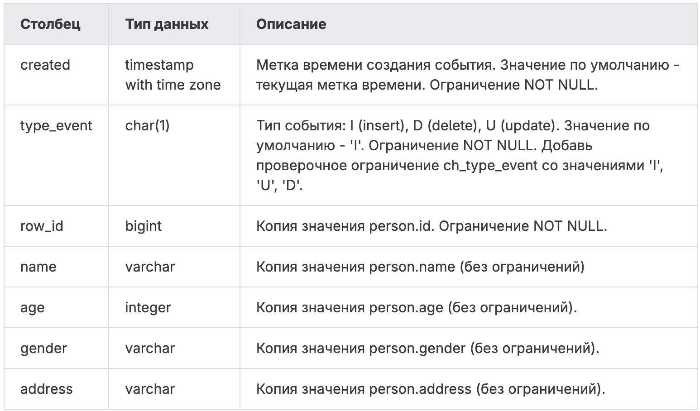

# SQLB11   
Этот день был посвящён переносу бизнес-логики внутрь PostgreSQL при помощи функций и триггеров. Я реализовала полноценную систему аудита операций INSERT/UPDATE/DELETE, освоила SQL-функции и PL/pgSQL-функции, а также научилась создавать функциональные обёртки и вычислительные функции в базе данных.   
   
**Изученные навыки**   
- создание таблиц аудита и структурирование служебных данных;   
- написание триггерных функций и работа с NEW/OLD записями;   
- создание AFTER-триггеров для INSERT, UPDATE, DELETE;   
- объединение триггеров в единый универсальный механизм аудита;   
- написание SQL-функций, возвращающих таблицы;   
- работа с функциями c параметрами по умолчанию;   
- написание PL/pgSQL-функций и использование управляющих конструкций;   
- разработка вычислительных функций (минимум массива, числа Фибоначчи).   
   
   
Модель БД с которой происходила работа   
   
    
Таблица пиццерия   
|     Поле |         Тип |                                                         Описание |
|:---------|:------------|:-----------------------------------------------------------------|
|       id | PRIMARY KEY |                                Уникальный идентификатор пиццерии |
|     name |     VARCHAR |                                                Название пиццерии |
|   rating |     DECIMAL |                             Средний рейтинг пиццерии (от 0 до 5) |

Таблица person   
|     Поле |         Тип |                                                                 Описание |
|:---------|:------------|:-------------------------------------------------------------------------|
|       id | PRIMARY KEY |                                    Уникальный идентификатор пользователя |
|     name |     VARCHAR |                                                         Имя пользователя |
|      age |     INTEGER |                                                     Возраст пользователя |
|   gender |     VARCHAR |                                                         Пол пользователя |
|  address |     VARCHAR |                                                       Адрес пользователя |

Таблица menu   
|         Поле |         Тип |                                                                Описание |
|:-------------|:------------|:------------------------------------------------------------------------|
|           id | PRIMARY KEY |                                   Уникальный идентификатор позиции меню |
| pizzeria\_id | FOREIGN KEY |                                        Ссылка на пиццерию (pizzeria.id) |
|  pizza\_name |     VARCHAR |                                               Название пиццы в пиццерии |
|        price |     DECIMAL |                                                   Цена конкретной пиццы |

Таблица person\_visits   
|         Поле |         Тип |                                                           Описание |
|:-------------|:------------|:-------------------------------------------------------------------|
|           id | PRIMARY KEY |                                 Уникальный идентификатор посещения |
|   person\_id | FOREIGN KEY |                                 Ссылка на пользователя (person.id) |
| pizzeria\_id | FOREIGN KEY |                                   Ссылка на пиццерию (pizzeria.id) |
|  visit\_date |        DATE |                              Дата посещения (например, 2022-01-01) |

Таблица person\_order   
|        Поле |         Тип |                                                     Описание |
|:------------|:------------|:-------------------------------------------------------------|
|          id | PRIMARY KEY |                              Уникальный идентификатор заказа |
|  person\_id | FOREIGN KEY |                           Ссылка на пользователя (person.id) |
|    menu\_id | FOREIGN KEY |                             Ссылка на позицию меню (menu.id) |
| order\_date |        DATE |                           Дата заказа (например, 2022-01-01) |

### Задание 00 — Audit of incoming inserts   
**Условие**   
Нужно реализовать механизм аудита для всех вставок (INSERT), которые выполняются в таблицу `person`.   
Для этого:   
1. Создать новую таблицу `person\_audit`, которая повторяет структуру `person`,   
    но дополнена служебными полями для аудита:   
    - `created` — дата/время события (NOT NULL, значение по умолчанию — текущий timestamp),   
    - `type\_event` — тип действия ( `I`, `U`, `D`), по умолчанию `'I'`,   
        добавить CHECK-ограничение `ch\_type\_event`,   
    - `row\_id` — копия `person.id` (NOT NULL).   
2. Создать триггерную функцию `fnc\_trg\_person\_insert\_audit`,   
    которая должна копировать данные новой вставленной строки в `person\_audit`.   
3. Создать триггер `trg\_person\_insert\_audit`, который:   
    - работает **FOR EACH ROW**,   
    - срабатывает **AFTER INSERT**,   
    - вызывает функцию `fnc\_trg\_person\_insert\_audit`.   
   
После создания всех объектов выполнить пример вставки для проверки работы триггера.   
   
Схема таблицы   
    
   
### Задание 01 — Audit of incoming updates   
**Условие**   
Реализовать аудит всех операций UPDATE для таблицы `person`.   
Необходимо:   
1. Создать триггерную функцию `fnc\_trg\_person\_update\_audit`,   
    которая записывает в `person\_audit` данные **старой строки (OLD)** перед обновлением.   
2. Создать триггер `trg\_person\_update\_audit`, который:   
    - работает **FOR EACH ROW**,   
    - срабатывает **AFTER UPDATE**.   
   
После реализации выполнить два оператора UPDATE, чтобы зафиксировать изменения в журнале аудита.   
   
### Задание 02 — Audit of incoming deletes   
**Условие**   
Добавить обработку операций DELETE для таблицы `person`.   
Нужно:   
1. Создать триггерную функцию `fnc\_trg\_person\_delete\_audit`,   
    которая записывает удаляемую строку (OLD) в таблицу `person\_audit`.   
2. Создать триггер `trg\_person\_delete\_audit`, который:   
    - работает **FOR EACH ROW**,   
    - срабатывает **AFTER DELETE**.   
   
После реализации — выполнить удаление пользователя с id = 10.   
   
### Задание 03 — Generic Audit   
**Условие**   
Объединить логику всех трёх триггеров (INSERT/UPDATE/DELETE) в один общий механизм аудита.   
Требуется:   
1. Создать новую универсальную триггерную функцию `fnc\_trg\_person\_audit`,   
    которая определяет тип операции через IF / ELSE и записывает соответствующие данные.   
2. Создать один общий триггер `trg\_person\_audit`, который:   
    - работает **FOR EACH ROW**,   
    - срабатывает **AFTER INSERT OR UPDATE OR DELETE**.   
3. Удалить старые три отдельных триггера и их функции.   
4. Очистить таблицу `person\_audit`.   
5. Повторно выполнить набор INSERT/UPDATE/DELETE, чтобы протестировать унифицированный аудит.   
   
   
### Задание 04 — Database View VS Database Function   
**Условие**   
Имеются два представления, которые показывают мужчин и женщин из таблицы `person`.   
Нужно заменить их функциями:   
1. Создать две SQL-функции:   
    - `fnc\_persons\_female()` — возвращает только женщин,   
    - `fnc\_persons\_male()` — возвращает только мужчин.   
   
Эти функции должны быть написаны **как SQL-functions (не PL/pgSQL)**   
и возвращать таблицу так же, как и представления.   
Проверить функции, используя вызов через SELECT.   
   
### Задание 05 — Parameterized Database Function   
**Условие**   
Удалить функции из предыдущего задания.   
Создать универсальную SQL-функцию `fnc\_persons(pgender text DEFAULT 'female')`,   
которая возвращает пользователей указанного пола.   
При отсутствии аргумента функция должна возвращать женщин.   
Функция — строго SQL-function, не PL/pgSQL.   
Проверка через пример вызова с параметрами и без.   
   
### Задание 06 — Function like a function-wrapper   
**Условие**   
Создать PL/pgSQL-функцию `fnc\_person\_visits\_and\_eats\_on\_date(...)`,   
которая по заданным параметрам:   
- имени пользователя (по умолчанию `'Dmitriy'`),   
- максимальной цене пиццы (по умолчанию `500`),   
- дате посещения (по умолчанию `2022-01-08`),   
   
должна вернуть список пиццерий, которые человек посещал в указанную дату   
и где можно купить пиццу дешевле указанной суммы.   
Функция должна быть написана именно в PL/pgSQL и работать как обёртка над SQL-запросом.   
   
### Задание 07 — Different view to find a Minimum   
**Условие**   
Создать функцию (SQL или PL/pgSQL — на выбор), которая:   
- принимает массив чисел,   
- возвращает **минимальное значение** этого массива.   
   
Имя функции: `func\_minimum`.   
   
### Задание 08 — Fibonacci algorithm is in a function   
**Условие**   
Написать функцию `fnc\_fibonacci(pstop integer DEFAULT 10)`,   
которая возвращает таблицу всех чисел Фибоначчи,   
которые **меньше значения pstop**.   
Тип функции — любой (SQL или PL/pgSQL).   
Пример вызова — через SELECT.   
